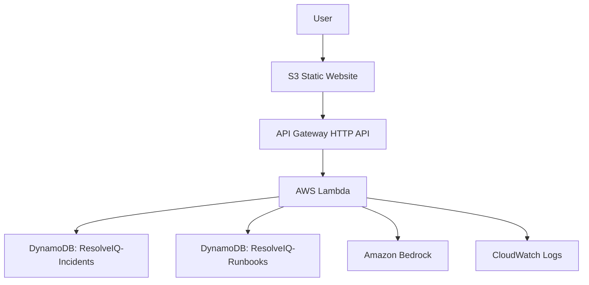

# ResolveIQ

**Evidence-first incident analysis and human-controlled runbook generation for IT and infrastructure teams.**

## Problem

Incident responders often repeat the same investigation without a clear way to
connect a current symptom to prior incidents, explain the strength of an
inference, or preserve a successful resolution for the next responder.

## Solution

ResolveIQ accepts an incident, retrieves bounded fictional historical evidence
and curated runbooks using deterministic scoring, and asks Amazon Bedrock for
structured diagnostic guidance. The UI separates current facts, retrieved
evidence, AI inference, recommended checks, uncertainty, and a reusable
runbook.

### Key differentiator

ResolveIQ does not present an AI guess as a confirmed root cause. Every model
analysis is bounded by retrieved records, evidence references are validated by
the backend, and recommendations remain human-controlled.

## Features

- Submit and persist an incident.
- Retrieve up to five relevant historical incidents and three curated runbooks.
- Analyze the incident with Amazon Bedrock.
- Display category, likely causes, confidence, evidence references, diagnostic
  checks, and uncertainty.
- Explicitly handle empty or no-match evidence.
- Generate and persist a structured runbook from a user-supplied resolution.
- Provide loading and API error states in a framework-free web UI.

All demonstration incidents, historical records, and resolutions are fictional
or anonymized. Arbitrary demo incidents may legitimately return no matching
historical evidence.

## Current deployment

- **Frontend:** [ResolveIQ demo](http://resolveiq-frontend-089781651236.s3-website-us-east-1.amazonaws.com/)
- **API:** `https://1ddl4fmkml.execute-api.us-east-1.amazonaws.com`
- **Region:** `us-east-1`
- **Provider:** Amazon Bedrock
- **Model:** `us.amazon.nova-2-lite-v1:0`

The frontend is hosted as an S3 static website. The public demo URL is HTTP;
CloudFront is not part of this deployment.

## Architecture



The deployed backend is defined by
[infrastructure/template.yaml](infrastructure/template.yaml). See
[docs/architecture.md](docs/architecture.md) for the runtime details.

### AWS services used

- Amazon S3 static website hosting
- Amazon API Gateway HTTP API
- AWS Lambda
- Amazon DynamoDB
- Amazon Bedrock
- Amazon CloudWatch Logs
- AWS SAM / CloudFormation for backend deployment

No vector database, RAG service, Kubernetes, MCP layer, ServiceNow
integration, or automatic remediation is used.

## Evidence-first behavior

The analysis response distinguishes:

1. **Current incident facts** supplied by the responder.
2. **Historical evidence** retrieved by deterministic application logic.
3. **AI inference** with confidence and validated evidence IDs.
4. **Recommended actions** that require human execution and approval.

The backend sends only bounded retrieved records to Bedrock and rejects
unknown evidence references or malformed structured output. If retrieval
returns no records, the response says so and marks likely causes as
uncertain rather than treating them as facts.

## Workflows

### Incident analysis

```text
Submit incident
  → Validate input
  → Persist incident
  → Retrieve and rank bounded evidence
  → Invoke Bedrock
  → Validate analysis and evidence references
  → Persist analysis and return results
```

Endpoint: `POST /incidents/analyze`

### Runbook generation

```text
Provide successful resolution
  → Retrieve incident, validated analysis, and bounded evidence
  → Invoke Bedrock
  → Validate structured runbook
  → Preserve submitted resolution
  → Persist and return runbook
```

Endpoint: `POST /incidents/{incidentId}/runbook`

Runbooks are guidance for human review. ResolveIQ never executes remediation.

## Local development

### Backend tests

```powershell
python -m venv .venv
.\.venv\Scripts\Activate.ps1
pip install -r requirements.txt
python -m pytest -q
python -m compileall -q backend tests
```

### Local frontend

The frontend is plain HTML, CSS, and JavaScript. Serve it with any static
server:

```powershell
python -m http.server 8765 --directory frontend
```

Open `http://localhost:8765/`. The checked-in
[frontend/config.js](frontend/config.js) points to the deployed API.

## Backend deployment

The existing backend stack is `resolveiq` in `us-east-1`. With AWS credentials
available through the normal AWS provider chain:

```powershell
sam validate --template-file infrastructure/template.yaml --region us-east-1
sam build --template-file infrastructure/template.yaml
sam deploy --template-file .aws-sam\build\template.yaml `
  --config-file infrastructure\samconfig.toml `
  --no-confirm-changeset --no-fail-on-empty-changeset
```

The deployment configuration sets `AnalysisProvider=bedrock` and
`BedrockModelId=us.amazon.nova-2-lite-v1:0`.

## Frontend deployment

Upload the four files in `frontend/` to an S3 bucket configured for static
website hosting:

```text
index.html
app.js
config.js
styles.css
```

Do not upload credentials or backend source files. The current demo uses the
S3 website URL listed above and does not provide HTTPS frontend hosting.

## Testing

The current repository verification includes:

- 45 passing Python tests.
- Python compilation checks.
- SAM template validation and deployment.
- JavaScript syntax checks with `node --check`.
- Live API analysis and runbook requests.
- Headless Chrome end-to-end testing of the deployed frontend.

## Security and design considerations

- AWS credentials stay in the AWS runtime/provider chain, never in frontend
  code.
- Demo data is fictional or anonymized.
- Input, model output, confidence values, and evidence IDs are validated.
- Bedrock receives bounded context rather than unrestricted database access.
- Production changes are never performed automatically.
- Generated recommendations require human review and approval.

## Limitations

- Retrieval is deterministic and uses the small seeded demo dataset; it is not
  an embedding or vector search system.
- A fictional incident may have no matching evidence.
- The public static website URL is HTTP because CloudFront is not deployed.
- There is no authentication or multi-tenant access control.
- There is no real ServiceNow or production infrastructure integration.

## Future improvements

- Add authenticated access before using the system beyond a demo.
- Improve retrieval and dataset management while preserving evidence
  traceability.
- Add HTTPS hosting if the deployment needs a production-style public URL.
- Add richer observability and deployment automation.

These are future directions, not current features.
