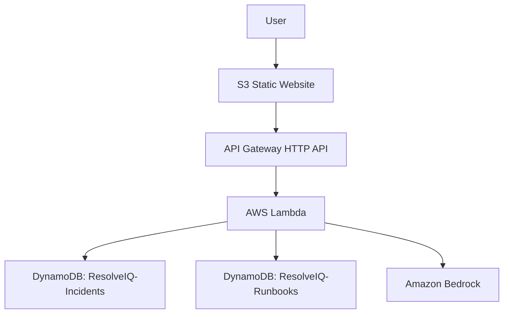

# ResolveIQ current architecture

## Deployed runtime

The current public frontend is the framework-free site at
`http://resolveiq-frontend-089781651236.s3-website-us-east-1.amazonaws.com/`.
It calls the deployed API at
`https://1ddl4fmkml.execute-api.us-east-1.amazonaws.com`.
The frontend URL is HTTP because CloudFront is not part of the current
deployment.

The backend is deployed in `us-east-1` with:

- API Gateway HTTP API
- Lambda function `ResolveIQ-IncidentAnalysis`
- DynamoDB tables `ResolveIQ-Incidents` and `ResolveIQ-Runbooks`
- Amazon Bedrock model `us.amazon.nova-2-lite-v1:0`
- CloudWatch Logs through the Lambda execution role

The deployed analysis provider is `bedrock`. The backend source and resources
are defined in [infrastructure/template.yaml](../infrastructure/template.yaml).

## Incident analysis

`POST /incidents/analyze` follows this path:

1. Validate required and optional incident fields.
2. Create and persist a current incident record.
3. Load bounded fictional historical incidents and curated runbooks from
   DynamoDB.
4. Rank records using deterministic service, category, tag, symptom, and token
   matches.
5. Send only the bounded retrieved records and current incident facts to
   Bedrock.
6. Validate the structured analysis, confidence values, and evidence IDs.
7. Persist the validated analysis with the incident and return facts, evidence,
   and analysis to the frontend.

Retrieval is ordinary backend logic. ResolveIQ does not use a vector database,
embeddings, a RAG service, or unrestricted model access.

## Evidence and uncertainty

The response separates:

- Current incident facts.
- Retrieved historical evidence and curated runbook evidence.
- AI inference, including confidence and supporting evidence IDs.
- Recommended diagnostic checks.
- Uncertainty and limitations.

Evidence is bounded and model references are checked against the exact
retrieval result. If no records match, the API returns an empty evidence list
and the model is instructed to state that limitation. Arbitrary fictional demo
incidents may therefore have no supporting historical evidence.

## Runbook generation

`POST /incidents/{incidentId}/runbook`:

1. Validates the user-supplied successful resolution.
2. Retrieves the stored incident and validated analysis.
3. Retrieves the same bounded evidence context.
4. Invokes the Bedrock runbook adapter.
5. Validates the structured runbook response.
6. Preserves the exact submitted resolution as a human-controlled remediation
   item.
7. Persists the generated runbook in `ResolveIQ-Runbooks`.
8. Returns the runbook to the frontend.

The runbook contains problem, preconditions, diagnostic steps, verification,
remediation, and escalation sections. ResolveIQ does not execute any of them.

## Persistence and validation

Current incidents and their validated analyses are stored in
`ResolveIQ-Incidents`. Curated and generated runbooks are stored in
`ResolveIQ-Runbooks`. DynamoDB-safe numeric conversion is applied when analysis
confidence values are persisted.

The backend rejects invalid input, malformed Bedrock output, invalid confidence
values, unknown evidence IDs, and invalid runbook fields. AWS service failures
are returned as explicit API errors.

## Scope boundaries

The deployed MVP uses fictional/demo data and does not include authentication,
real ServiceNow integration, automatic remediation, Kubernetes, MCP, vector
search, or CloudFront.
